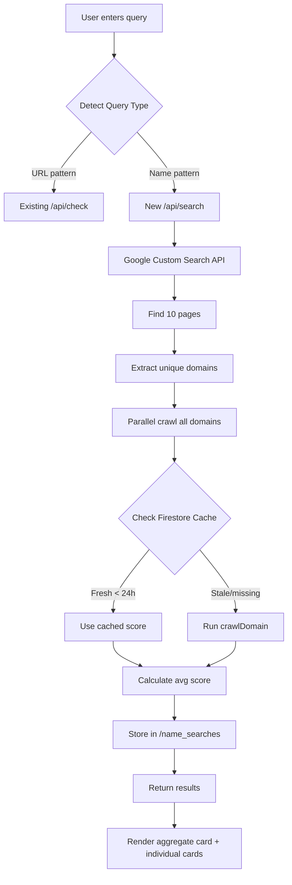

# Add Name Search to Alpha Search Index

## Overview

Extend the existing URL checker to support **name search** queries. When users enter a name instead of a URL, the system will:

1. Use Google Custom Search API to find all pages mentioning that name
2. Crawl and score each page using existing `/api/check` logic
3. Return an aggregated AI presence score across all pages
4. Display individual score cards for each page found

This transforms Alpha Search from a single-URL checker into an AI reputation index.

## Architecture



## Implementation Steps

### 1. Google Custom Search API Setup

**Prerequisites (User must complete):**

1. Enable Custom Search API: https://console.cloud.google.com/apis/library/customsearch.googleapis.com
2. Create Programmable Search Engine: https://programmablesearchengine.google.com

   - Set to "Search the entire web"
   - Copy Search Engine ID (cx)

3. Generate API key in GCP Console
4. Add to environment:
   ```bash
   # Local: functions/.env
   GOOGLE_API_KEY=your_key_here
   GOOGLE_CX=your_cx_here
   
   # Production:
   firebase functions:config:set google.api_key="YOUR_KEY" google.cx="YOUR_CX"
   ```


**Pricing:** $0.005/query after 100 free queries/day

### 2. Refactor Crawler Module

**File:** [`functions/crawler.js`](functions/crawler.js)

**Changes needed:**

- Ensure `crawlDomain()` is exported (already is ✓)
- Add helper function to extract domain from full URL
- No changes to scoring logic (locked formula)

**New exports:**

```javascript
module.exports = {
  normalizeDomain,
  parseJsonLd,
  calculateScore,
  getGrade,
  crawlDomain,
  extractDomain  // NEW: extract domain from any URL
};
```

### 3. Add `/api/search` Endpoint

**File:** [`functions/index.js`](functions/index.js)

**New endpoint:** `POST /api/search`

**Request:**

```json
{
  "query": "Terry French"
}
```

**Response:**

```json
{
  "query": "Terry French",
  "totalPages": 8,
  "avgScore": 61,
  "grade": "Machine Ready",
  "gradeClass": "machine-ready",
  "results": [
    {
      "domain": "gridnetai.com",
      "pageTitle": "Terry French - Founder at Gridnet",
      "pageUrl": "https://gridnetai.com/about",
      "score": 93,
      "grade": "AI Native",
      "gradeClass": "ai-native",
      "machineProfile": { ... },
      "fromCache": false
    },
    ...
  ]
}
```

**Implementation flow:**

1. Call Google Custom Search API with query
2. Extract unique domains from results (deduplicate)
3. Check Firestore cache for each domain (24h freshness)
4. Crawl uncached domains in parallel (max 10)
5. Calculate aggregate score across all results
6. Store search metadata in `/name_searches` collection
7. Return aggregated + individual results

**Key functions to add:**

- `findPagesForName(query)` — Google API call
- `extractUniqueDomains(pages)` — Deduplicate by domain
- `getCachedResult(domain)` — Check Firestore `/index/{domain}`
- `handleNameSearch(req, res)` — Main endpoint handler

### 4. Update Firestore Rules

**File:** [`firestore.rules`](firestore.rules)

**Add new collection:**

```
match /name_searches/{id} {
  allow read: if true;
  allow create: if true;
  allow update, delete: if false;
}
```

**Schema:**

```javascript
{
  query: "Terry French",
  totalPages: 8,
  avgScore: 61,
  grade: "Machine Ready",
  searchedAt: Timestamp,
  resultDomains: ["gridnetai.com", "linkedin.com", ...],
  source: "public"
}
```

### 5. Update Frontend — Query Detection

**File:** [`public/index.html`](public/index.html)

**Add query type detection:**

```javascript
function detectQueryType(input) {
  const trimmed = input.trim();
  
  // URL patterns: contains dot with no spaces, or starts with http
  const isUrl = /^https?:\/\//i.test(trimmed) ||
    (/\S+\.\S+/.test(trimmed) && !trimmed.includes(' '));
  
  return isUrl ? 'url' : 'name';
}
```

**Update search handler:**

```javascript
async function handleSearch() {
  const input = document.getElementById('searchInput').value.trim();
  if (!input) return;
  
  const queryType = detectQueryType(input);
  
  if (queryType === 'url') {
    handleUrlCheck(input);      // Existing function (rename from handleSearch)
  } else {
    handleNameSearch(input);    // New function
  }
}
```

**Dynamic button label:**

- URL detected → "Check"
- Name detected → "Search"

**Update placeholder:**

```html
placeholder="enter a url or name to search..."
```

### 6. Add Name Search UI Components

**File:** [`public/index.html`](public/index.html)

**A. Aggregate header card** (appears first)

```html
<div class="aggregate-card">
  <div class="aggregate-header">
    <div>
      <div class="aggregate-query">"{query}"</div>
      <div class="aggregate-sub">{n} pages found across the web</div>
    </div>
    <div class="score-number">
      <div class="score-big">{avgScore}<span>/100</span></div>
      <div class="score-label">Avg. AI Readiness Score</div>
    </div>
  </div>
  <div class="score-bar-bg">
    <div class="score-bar-fill" style="width:{avgScore}%"></div>
  </div>
  <div class="score-grade-pill {gradeClass}">● {grade} — AI Presence</div>
  <div class="card-actions">
    <button class="card-btn">↗ Share Score</button>
  </div>
</div>
```

**CSS:** Style identically to `.score-card` (same neumorphic shadows, padding, border-radius)

**B. Individual page cards**

Reuse existing `buildScoreCard()` function with modifications:

1. Add page title above domain
2. Replace "Claim Listing" with "View Page" link

**New CSS:**

```css
.page-title {
  font-size: 11px;
  font-family: 'DM Mono', monospace;
  color: var(--text-tertiary);
  margin-bottom: 3px;
  white-space: nowrap;
  overflow: hidden;
  text-overflow: ellipsis;
  max-width: 300px;
}

.aggregate-card {
  /* Same as .score-card */
}

.aggregate-query {
  font-size: 19px;
  font-weight: 600;
  color: var(--text-primary);
  margin-bottom: 6px;
}

.aggregate-sub {
  font-size: 12px;
  font-family: 'DM Mono', monospace;
  color: var(--text-secondary);
}
```

**C. Staggered animation**

Cards appear one by one with 80ms delay:

```javascript
results.forEach((result, i) => {
  setTimeout(() => {
    const bubble = document.createElement('div');
    bubble.className = 'bubble-system';
    bubble.innerHTML = buildScoreCard(result.domain, result, result.pageTitle, result.pageUrl);
    chatArea.appendChild(bubble);
    scrollBottom();
  }, i * 80);
});
```

**D. Loading states**

Two-phase messaging with dynamic update:

- **Phase 1** (initial): `Searching for "{query}"...`
- **Phase 2** (after API returns page count): `Found {n} pages · Scoring each one...`

**⚠️ CRITICAL:** The phase 2 message `Found {n} pages · Scoring each one...` must update **dynamically with the actual count returned from the API** before the crawl results come back. This is NOT a hardcoded number.

**Implementation:**

```javascript
// Phase 1: Show immediately
const typing = document.createElement('div');
typing.className = 'typing-indicator visible';
typing.innerHTML = `
  <div class="typing-dots">
    <div class="typing-dot"></div>
    <div class="typing-dot"></div>
    <div class="typing-dot"></div>
  </div>
  <span class="typing-message">Searching for "${query}"...</span>
`;
chatArea.appendChild(typing);

// Call API
const response = await fetch('/api/search', { ... });
const data = await response.json();

// Phase 2: Update message with actual count (before rendering results)
const typingMessage = typing.querySelector('.typing-message');
typingMessage.textContent = `Found ${data.totalPages} pages · Scoring each one...`;

// Then render results...
```

### 7. Share Function for Name Search

```javascript
function shareNameScore(query, score) {
  const text = `"${query}" scored ${score}/100 on Alpha Search — find out how AI-visible any name is. search.gridnetai.com`;
  if (navigator.share) { 
    navigator.share({ text }); 
  } else { 
    navigator.clipboard.writeText(text).then(() => alert('Copied to clipboard!')); 
  }
}
```

## Edge Cases & Error Handling

### No Results Found

```html
<div class="aggregate-card">
  <div class="aggregate-query">"{query}"</div>
  <div class="aggregate-sub">No pages found — try a more specific name</div>
  <div class="score-big">0<span>/100</span></div>
</div>
```

### All Crawls Failed

```javascript
if (results.length === 0 && pages.length > 0) {
  return {
    avgScore: 0,
    grade: 'Not AI Ready',
    message: 'Pages were found but none were reachable'
  };
}
```

### Partial Failures

```javascript
// Include only successful crawls in average
const successfulResults = crawlResults.filter(r => r.status === 'fulfilled');
// Show: "X of Y pages scored"
```

### Rate Limiting

- Cap at 10 pages per search
- Reuse 24h cache from URL checks
- Google API: 100 free queries/day

## Key Technical Decisions

### Query Type Detection Logic

```
"stripe.com"              → URL (has dot, no spaces)
"https://stripe.com/docs" → URL (starts with http)
"Terry French"            → Name (has space)
"Gridnet"                 → Name (no dot)
"Apple"                   → Name (no dot)
```

### Caching Strategy

- **Domain scores:** 24h cache (shared between URL checks and name searches)
- **Name search results:** No caching (always fresh, but uses cached domain scores)
- **Rationale:** Names can appear on new pages daily; domain AI readiness changes slowly

### Scoring Aggregation

```javascript
avgScore = Math.round(
  results.reduce((sum, r) => sum + r.score, 0) / results.length
);
```

Simple average across all successfully crawled pages.

### Parallel Crawling

```javascript
const crawlResults = await Promise.allSettled(
  uniquePages.slice(0, 10).map(async (page) => {
    // Check cache first, then crawl
  })
);
```

All crawls run in parallel (4-8s total, not 40-80s sequential).

## Files to Modify

1. **`functions/crawler.js`** — Export `extractDomain()` helper
2. **`functions/index.js`** — Add `/api/search` endpoint
3. **`functions/.env`** — Add `GOOGLE_API_KEY` and `GOOGLE_CX`
4. **`firestore.rules`** — Add `/name_searches` collection rule
5. **`public/index.html`** — Add query detection, name search UI, aggregate card

## Files NOT to Touch

- ❌ Do not modify existing `/api/check` endpoint
- ❌ Do not change `crawlDomain()` scoring logic
- ❌ Do not modify `normalizeDomain()` function (used by URL check flow)
- ❌ Do not redesign existing score card UI
- ❌ Do not add authentication
- ❌ Do not add CSS frameworks
- ❌ Do not consolidate `normalizeDomain()` and `extractDomain()` — they are different functions

## Success Criteria

✅ User enters "Terry French" → finds 8 pages → shows aggregate score + 8 individual cards

✅ User enters "stripe.com" → existing URL check flow works unchanged

✅ Cached domain scores reused (no redundant crawls)

✅ Aggregate card shows average score across all pages

✅ Individual cards animate in with 80ms stagger

✅ Share button works for name searches

✅ All searches stored in `/name_searches` collection

✅ Google Custom Search API calls are server-side only

## Testing Plan

### Local Testing

1. Start emulators: `npm run serve`
2. Test URL query: `stripe.com` → should use existing flow
3. Test name query: `Terry French` → should call `/api/search`
4. Verify Google API is called (check logs)
5. Verify aggregate card renders
6. Verify individual cards render with stagger
7. Test edge cases (no results, all failures)

### Production Testing

1. Deploy: `firebase deploy`
2. Test with real names
3. Monitor Google API usage (stay under 100/day free tier)
4. Check `/name_searches` collection populates
5. Verify caching works (check Firestore reads)

## Context

This feature transforms Alpha Search from a developer tool (check one URL) into a consumer product (search any name). The same infrastructure that scores URLs now scores entire AI presences across the web. This is fundamentally different from every competitor — they check one URL, we find and score every page a name lives on.

**Strategic insight:** The `/name_searches` collection becomes the foundation for a future entity index — knowing which names are searched most, which pages are most associated with which names, building a graph of AI-visible entities across the web.

---

**Implementation time:** ~2-3 hours

**Complexity:** Medium (new API integration, UI extension)

**Risk:** Low (doesn't touch existing URL check flow)