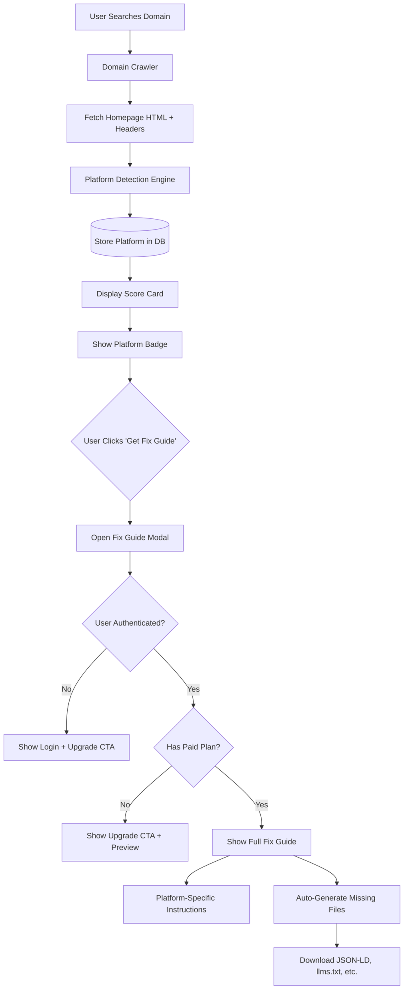

# AI Readiness Fix Feature - Platform Detection & Monetization

## Overview

Transform Alpha Search from discovery-only to discovery + solution by detecting website platforms and providing actionable, platform-specific fix instructions. This addresses the key beta tester question: "How do I fix it?"

## Architecture




## Implementation Plan

### Phase 1: Platform Detection Engine

**File**: `[functions/platform-detector.js](functions/platform-detector.js)` (new)

Create a comprehensive platform detection module that analyzes:

- **HTTP Headers**: `X-Wix-Request-Id`, `X-Powered-By`, `Server`, `X-Shopify-Stage`
- **HTML Meta Tags**: `<meta name="generator">`, `<meta name="platform">`
- **Script/Link Sources**: `static.parastorage.com` (Wix), `cdn.shopify.com`, `assets.squarespace.com`
- **HTML Patterns**: WordPress `wp-content`, `wp-includes`, Webflow `webflow.io`
- **URL Patterns**: `myshopify.com`, `wixsite.com`, `squarespace.com`

Detection priority order:

1. HTTP headers (most reliable)
2. Meta generator tags
3. Asset CDN domains
4. HTML class/ID patterns
5. URL structure

**Supported Platforms**:

- Wix, WordPress, Squarespace, Shopify, Webflow, Weebly, GoDaddy Website Builder, Hostinger, Jimdo, Strikingly, Carrd, Ghost, Drupal, Joomla, Magento, BigCommerce, WooCommerce, Elementor, Duda, Site123, Zyro, Cargo, Format
- Return `"custom"` for undetected platforms

### Phase 2: Database Schema Updates

**File**: `[functions/db/schema.sql](functions/db/schema.sql)`

Add platform detection fields to `record_domains` table:

```sql
ALTER TABLE record_domains ADD COLUMN IF NOT EXISTS platform VARCHAR(100);
ALTER TABLE record_domains ADD COLUMN IF NOT EXISTS platform_confidence VARCHAR(20); -- 'high', 'medium', 'low'
ALTER TABLE record_domains ADD COLUMN IF NOT EXISTS platform_signals JSONB; -- Detection evidence
CREATE INDEX idx_record_domains_platform ON record_domains(platform);
```

### Phase 3: Crawler Integration

**File**: `[functions/crawler.js](functions/crawler.js)`

Modify `crawlDomain()` function to:

1. Capture response headers from homepage fetch
2. Pass HTML + headers to `detectPlatform(html, headers)`
3. Include platform data in crawl results

**Changes**:

- Line 140-143: Store response object to access headers
- Line 158: Call `detectPlatform(html, homepageResult.value.headers)`
- Line 196-203: Add platform data to return object

### Phase 4: API Response Enhancement

**File**: `[functions/api-extensions.js](functions/api-extensions.js)`

Update `dualWriteDomainResult()` to include platform data in `type_data`:

```javascript
const type_data = {
  homepage_url: `https://${domain}`,
  llms_txt: crawlResult.machineProfile.llmsTxt,
  json_ld: crawlResult.machineProfile.jsonLd,
  // ... existing fields ...
  platform: crawlResult.platform || 'custom',
  platform_confidence: crawlResult.platformConfidence || 'low',
  platform_signals: crawlResult.platformSignals || {}
};
```

### Phase 5: Fix Guide Templates

**File**: `[functions/fix-guides/platform-templates.js](functions/fix-guides/platform-templates.js)` (new)

Create platform-specific fix templates with:

- **What You Can Fix**: Step-by-step instructions for each missing signal
- **Platform Limitations**: What's not possible on this platform
- **Realistic Score Ceiling**: Expected max score after fixes
- **Video/Image Resources**: Links to tutorial content
- **Copy-Paste Code**: Ready-to-use JSON-LD, llms.txt content

Templates for: Wix, WordPress, Squarespace, Shopify, Webflow, Weebly, Custom

### Phase 6: File Generation Service

**File**: `[functions/file-generator.js](functions/file-generator.js)` (new)

Create auto-generation functions:

- `generateJsonLd(domain, platform, businessType)`: Creates schema.org markup
- `generateLlmsTxt(domain, description, pages)`: Creates llms.txt content
- `generateOpenApiStub(domain)`: Creates basic OpenAPI spec
- `generateMcpStub(domain)`: Creates MCP endpoint stub

Use domain metadata (title, description) and platform context to personalize generated files.

### Phase 7: Frontend UI Updates

**File**: `[public/index.html](public/index.html)`

**Score Card Enhancement** (lines 3220-3248):

1. Add platform badge below domain name: `<div class="platform-badge">🏗️ Built on Wix</div>`
2. Replace generic "What to do next" with "Get Fix Guide for Wix" button
3. On click, open Fix Guide Modal (new component)

**Fix Guide Modal** (new):

- Platform-specific instructions (tabbed: JSON-LD, llms.txt, OpenAPI, MCP)
- Download buttons for auto-generated files
- Video/image embeds for visual learners
- "Upgrade to Premium" CTA for free users (show preview only)
- Full access for paid users

**Settings Integration**:

- Add "Fix Guides" tab in Settings modal
- Show fix guides for all previously searched domains
- Track fix completion status

### Phase 8: Monetization Integration

**File**: `[functions/api/fix-guide.js](functions/api/fix-guide.js)` (new)

Create API endpoints:

- `POST /api/fix-guide/preview` - Free preview (platform detection + what's fixable)
- `POST /api/fix-guide/full` - Paid access (full instructions + file generation)
- `POST /api/fix-guide/generate` - Generate downloadable files (paid)

Check user plan via Stripe API before serving full content.

### Phase 9: Analytics & Tracking

**File**: `[functions/db/schema.sql](functions/db/schema.sql)`

Add fix guide tracking table:

```sql
CREATE TABLE fix_guide_requests (
  id UUID PRIMARY KEY DEFAULT uuid_generate_v4(),
  user_id VARCHAR(128) NOT NULL,
  domain TEXT NOT NULL,
  platform VARCHAR(100),
  guide_type VARCHAR(50), -- 'preview', 'full', 'generate'
  files_generated TEXT[], -- ['json-ld', 'llms-txt']
  created_at TIMESTAMP DEFAULT NOW()
);
```

Track conversion metrics: preview views → upgrades → file downloads → score improvements

## Key Technical Decisions

1. **Platform Detection**: Multi-signal approach (headers + HTML + assets) with confidence scoring
2. **Storage**: Add `platform` column to `record_domains` table (normalized) + `platform_signals` JSONB (detailed evidence)
3. **Monetization**: Free platform detection + preview, paid full guide + file generation
4. **UI/UX**: In-card "Get Fix Guide" button → modal with platform-specific tabs
5. **File Generation**: Server-side generation using domain metadata, not client-side
6. **Stripe Integration**: Check user plan before serving full content (use existing Stripe setup from Settings)

## Files to Create

- `functions/platform-detector.js` - Detection engine
- `functions/fix-guides/platform-templates.js` - Fix instruction templates
- `functions/file-generator.js` - Auto-generate machine files
- `functions/api/fix-guide.js` - API endpoints for fix guides

## Files to Modify

- `functions/crawler.js` - Integrate platform detection
- `functions/db/schema.sql` - Add platform columns and tracking table
- `functions/api-extensions.js` - Include platform in type_data
- `public/index.html` - Add platform badge, fix guide button, modal UI

## Revenue Impact

**Target Customer**: Small business owners who discover they're not AI-ready

**Pain Point**: "How do I fix it?" (validated by beta tester)

**Solution**: Platform-specific, copy-paste fix instructions + auto-generated files

**Pricing**: Free discovery + $9-29/month for fix guides (or one-time $49 per domain)

**Conversion Funnel**: Search → Low Score → Click "Get Fix Guide" → See Preview → Upgrade → Download Files → Re-scan → Higher Score → Testimonial

This is the missing monetization layer that turns Alpha Search from a diagnostic tool into a complete solution.