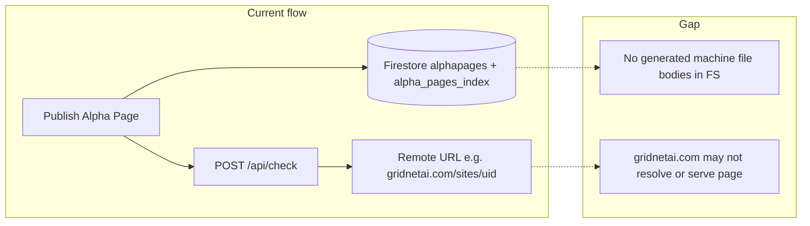

# Alpha Page gaps and implementation roadmap

## Gap summary

| Area                                    | Current state                                                                                                                                                                                                                                                                             | Gap                                                                                                                                                                                                                               |
| --------------------------------------- | ----------------------------------------------------------------------------------------------------------------------------------------------------------------------------------------------------------------------------------------------------------------------------------------- | --------------------------------------------------------------------------------------------------------------------------------------------------------------------------------------------------------------------------------- |
| **Machine files**                       | AI Visibility calls `POST /api/check` against the **canonical URL** (`ALPHA_PAGE_BASE_URL + '/sites/' + uid`) and interprets crawl results. On publish, `[alpha_pages_index](public/index.html)` gets `machineFiles: { jsonLd: null, llmsTxt: null, openApi: null }` (placeholders only). | Verification works **if** the URL is reachable and serves content; **no** generation of JSON-LD / llms.txt / OpenAPI bodies into Firestore or Storage from this app.                                                              |
| **Footer / rich text / chapters / DnD** | Builder uses plain fields + word-count style limits; no footer block, no real RTE, no ordered block array.                                                                                                                                                                                | Needs **schema** (`alphapages` + `alpha_pages_index`), **builder UI**, **preview**, and **persistence** end-to-end.                                                                                                               |
| **Links (logos / “sharing style”)**     | Link rows are mostly text + emoji in preview.                                                                                                                                                                                                                                             | Needs **favicon/OG-style** resolution (client: e.g. Google favicon API + optional `link` scrape; or **Cloud Function** proxy for CORS/privacy).                                                                                   |
| **Identity under [avatar][metrics]**    | Display name + correct `grid://` in preview.                                                                                                                                                                                                                                              | **Addressed in code** in `[public/index.html](public/index.html)` (`alphaPagePreviewName` / `alphaPagePreviewNameDesktop`, `updateAlphaPagePreview` using UID for `grid://` when `alphaPageUid` exists). **Post-deploy QA** only. |
| **Public URLs (`gridnetai.com/...`)**   | `public_url` and `ALPHA_PAGE_BASE_URL` default to `https://gridnetai.com` (`[public/index.html` ~9530](public/index.html)). Search indexes **Firestore**; it does **not** provision DNS or HTML on `gridnetai.com`.                                                                       | **NXDOMAIN** is expected until that host serves routes. Fix = **hosting you control** + **routes** + optional **env-driven base URL**.                                                                                            |

---

## Phase A — Public pages and DNS alignment (unblocks “link opens” and meaningful `/api/check`)

**Goal:** A chosen base URL actually resolves and returns a page; AI Visibility checks something real.

1. **Decide canonical base** — e.g. keep marketing on `gridnetai.com` (external team) **or** move public Alpha Page URLs to a hostname attached to this Firebase project (e.g. `alphasearch.gridnetai.com` / `alpha-search-index.web.app`).
2. **Single config source** — replace hardcoded `const ALPHA_PAGE_BASE_URL = 'https://gridnetai.com'` with build-time or runtime config (Firebase Hosting env, or one `window.__ALPHA_PAGE_BASE_URL__` injected at deploy) so staging/prod differ without editing HTML.
3. **Hosting routes** — today `[firebase.json](firebase.json)` only rewrites `/api/`** to `apiHandler`. Add SPA-style rewrites for public page routes you support, e.g. `/p/:slug` or `/sites/:uid`, serving a **thin shell** (`public/p.html` or route in `index.html` with path parsing) that:
  - Reads slug/uid from the path
  - Loads document from `alpha_pages_index` / `alphapages` (Firestore client with rules allowing **public read** for published pages only — verify `[firestore.rules](firestore.rules)`)
4. **Document** — `[docs/DEV.md](docs/DEV.md)` already covers DNS vs app; extend with “checklist: custom domain in Firebase + SSL + rewrite + Firestore rules.”

**Outcome:** Clicking the public URL from the app opens a real page; `/api/check` on that URL can return real signals instead of failing on NXDOMAIN.

---

## Phase B — Builder: footer, RTE, blocks + reorder

**Goal:** Product-level editor, not a one-line fix.

1. **Data model** — e.g. `contentBlocks: Array<{ id, type: 'text'|'chapter'|'footer', order, html?: string, title?: string }>` (or Markdown + sanitize on render). Migrate existing `richText` / long bio fields carefully.
2. **UI** — lightweight RTE (e.g. TipTap, Quill, or markdown + preview) with **bold**, chapter headings, save to Firestore.
3. **Reorder** — `@dnd-kit` or SortableJS in the builder; persist `order` in the block array.
4. **Footer** — dedicated block type or `footerHtml`; mirror in preview and in Phase A public shell.
5. **Index** — extend `alpha_pages_index` payload in the same publish path as today (`[public/index.html](public/index.html)` ~10844–10870) so search/discovery includes new fields.

---

## Phase C — Links: favicons and richer cards

**Goal:** Domain → icon (and optionally title) without fake emoji-only rows.

1. **Client-first:** derive hostname from URL, request `https://www.google.com/s2/favicons?domain=...` or similar; cache in memory; fallback letter avatar.
2. **Optional server:** `GET /api/link-preview?url=` in `[functions/index.js](functions/index.js)` to fetch OG tags (respect robots, timeouts, size limits) if you need titles/images and want to avoid client CORS issues.

---

## Phase D — Machine files: choose product direction

**Option 1 — Honest scope (fast):** Keep verification-only; **rename/help text** in the AI Visibility panel to say signals are **detected from the live URL**, not “generated by Alpha Search.” Optionally **stop writing** null `machineFiles` or write `{ mode: 'remote_verify' }` to avoid implying stored artifacts.

**Option 2 — Full generation (larger):** On publish (or scheduled job), **generate** JSON-LD snippet, `llms.txt` fragment, and optional OpenAPI stub from page metadata; store bodies in **Firestore** or **Cloud Storage**; expose them via the **Phase A** public shell at predictable paths (`/.well-known/...`, `/llms.txt`, etc.) **only if** that shell is the canonical host.

**Implementation touchpoints:** same publish handler in `[public/index.html](public/index.html)`; possibly new Cloud Function for generation + upload to avoid huge client payloads.

---

## Phase E — QA and verification

- **Identity preview:** After deploy, confirm name + `grid://{uid}` + public URL in the preview block.
- **End-to-end:** Publish → open public URL (Phase A) → open AI Visibility → confirm `/api/check` succeeds and panel matches page.
- **Search:** Confirm `alpha_pages_index` fields still match `[functions/index.js](functions/index.js)` search/read paths (e.g. collection query ~453).

---

## Suggested order of execution

1. **Phase A** (hosting + base URL + public shell) — removes NXDOMAIN confusion for users of this app’s domain.
2. **Phase B** — core product differentiation.
3. **Phase C** — polish.
4. **Phase D** — after strategic choice (verify-only vs generate).
5. **Phase E** — continuous QA.

