# Alpha Page: UID, Slug, Web Address, and Preview Tabs

## Current state

- **Identity section** ([public/index.html](public/index.html) ~3260–3276): Name, Grid Address (slug-only input with `grid://` prefix), Caption. No UID, no Web Address, no helper text.
- **Publish** ([public/index.html](public/index.html) ~5553–5607): Saves to `alphapages/{currentUser.uid}` with `displayName`, `bio`, `signals`, `coverDataUrl`, `updatedAt`. Success URL is `https://gridnetai.com/sites/` + **user UID** (no page UID, no slug-based public URL).
- **Preview**: Single phone mockup; no tabs. `updateAlphaPagePreview()` (~5448) drives name, grid address, caption, links.
- **Firestore**: No rules for `alphapages` in [firestore.rules](firestore.rules); collection is currently keyed by user UID.

## Target model (per your spec)


| Concept           | Purpose                                | Example                                                       |
| ----------------- | -------------------------------------- | ------------------------------------------------------------- |
| **UID**           | Canonical machine identity (permanent) | `xK9mP2qR7s`                                                  |
| **Slug**          | Human-friendly handle (editable)       | `gridnet-team`                                                |
| **Canonical URL** | Permanent source of truth              | `https://gridnetai.com/sites/xK9mP2qR7s`                      |
| **Public URL**    | Shareable / branding                   | `https://gridnetai.com/gridnet-team`                          |
| **Grid Address**  | Machine identity                       | `grid://xK9mP2qR7s` (optional display: `grid://gridnet-team`) |


Backend payload to persist (merge with existing):

```json
{
  "uid": "xK9mP2qR7s",
  "slug": "gridnet-team",
  "name": "Gridnet Team",
  "caption": "Building AI as a Utility",
  "canonical_url": "https://gridnetai.com/sites/xK9mP2qR7s",
  "public_url": "https://gridnetai.com/gridnet-team",
  "grid_address": "grid://xK9mP2qR7s"
}
```

Keep existing: `displayName`/`bio`, `signals`, `coverDataUrl`, `updatedAt`. Align field names in code with above (e.g. persist `name`/`caption` and/or keep `displayName`/`bio` for compatibility).

---

## 1. Identity section UI and behavior

**File:** [public/index.html](public/index.html)

- **Order of fields:** Name *, Grid Address, Web Address, Caption *.
- **Name *** (existing): Keep `alphaPageDisplayName`; continue to drive slug and preview.
- **Grid Address:**  
  - **Option A (recommended):** Show **read-only** `grid://{pageUid}` once UID exists; for new pages show e.g. `grid://—` until first publish. Optional: secondary line “Display: grid://{slug}” for UX.  
  - **Option B:** Keep an editable slug field labeled “Grid handle” and show “Grid Address: grid://{uid}” as read-only below.  
  Implementer can choose; spec allows “grid://gridnet-team” as display alias. For backend truth, always store and use `grid_address: grid://{uid}`.
- **Web Address (new):** Read-only text or input, value = `https://gridnetai.com/{slug}`. Base domain configurable (e.g. constant `ALPHA_PAGE_BASE_URL = 'https://gridnetai.com'`). Update on slug/name change (slug derived from name when syncing).
- **Caption *** (existing): Keep `alphaPageBio`.
- **Helper copy** under Identity (small, muted):
  - “Grid Address = your permanent machine-readable identity.”
  - “Web Address = your public page for Google, sharing, and AI discovery.”

**Logic:**

- **Slug:** Keep `slugify()`; keep syncing slug from name in `alphaPageSyncGridAddress()` but treat the **editable** field as the slug (e.g. rename or duplicate so one input is “slug/handle” and Grid Address display is UID-based). When name changes, suggest slug; user can edit slug; Web Address = base + slug.
- **Page UID:** Generate once per page (e.g. on first open of builder or first publish). Use a short random id (e.g. 9–11 alphanumeric, client-side). Store in Firestore so subsequent loads reuse it. If doc exists and has `uid`, use it; else generate, then save with merge on publish.
- **Load existing page:** When opening the builder, if `alphapages/{userId}` exists, read `uid`, `slug`, `name`, `caption`, etc., and prefill form and Grid/Web displays.

---

## 2. Data flow and publish

**File:** [public/index.html](public/index.html)

- **State:** Keep or add `alphaPageUid` (string or null). On `openAlphaPageCreate()`, try to load `alphapages/{currentUser.uid}`; if doc has `uid`, set `alphaPageUid` and slug/name/caption from doc; else generate new UID (e.g. `generatePageUid()`), set `alphaPageUid`, leave slug from slugify(name).
- **Publish payload** (merge): In addition to existing fields, send: `uid`, `slug` (from slug input), `name` (from Name field), `caption` (from Caption), `canonical_url`, `public_url`, `grid_address` (all derived from UID and slug and base URL). Ensure slug is validated (format, length) and optionally checked for uniqueness if you have backend support.
- **Success message / copy:** Show both URLs: canonical `https://gridnetai.com/sites/{uid}` and public `https://gridnetai.com/{slug}`. Optionally: “Grid Address: grid://{uid}”.

**Backend / hosting (out of scope for this app but note for later):** Resolving `https://gridnetai.com/{slug}` to the same page as `/sites/{uid}` (redirect or server-side lookup) and slug uniqueness are backend/hosting concerns; the plan only ensures the client stores and displays the right values.

---

## 3. Preview: three tabs (Page, Share, Search)

**File:** [public/index.html](public/index.html)

- **Placement:** Above the phone mockup (or above the whole preview column), add a tab strip: **[ Page ] [ Share ] [ Search ]**.
- **Tab state:** One active tab; switching shows the corresponding preview content. Use a small data attribute or class (e.g. `data-preview-mode="page"|"share"|"search"`) and one container that swaps content, or three panels and show/hide by class.
- **Page:** Current phone mockup; existing `updateAlphaPagePreview()` continues to drive name, grid address, caption, links, cover. No change to structure except that this view is behind the “Page” tab.
- **Share:** Simulate Open Graph / iMessage-style card:
  - Card layout: thumbnail (cover image or placeholder), title (name), description (caption), domain (e.g. `gridnetai.com/gridnet-team` or full public URL).
  - Styling: compact card (e.g. max width 400px), optional subtle border/shadow to mimic social preview. No need to call real OG endpoints; use current form values and `public_url` / slug.
- **Search:** Simulate a Google result snippet:
  - Green/URL line: `https://gridnetai.com/{slug}` (or truncated).
  - Title line: “{Name}  Alpha Page” (or similar).
  - Description: One line from caption + “Discover links, profile, and AI-readable identity.” (or your chosen meta description).
- **Updates:** When name, slug, caption, or cover change, `updateAlphaPagePreview()` (or a single “refresh all previews” function) should update the active tab’s content; when switching tabs, render that tab’s content from current state. Share and Search panels can be simple divs with IDs; fill them in the same function or in a dedicated `updateSharePreview()` / `updateSearchPreview()` called from `updateAlphaPagePreview()`.

---

## 4. Firestore and security

- **Collection:** Keep `alphapages/{userId}` (one Alpha Page per user) with new fields. No need to change document ID to page UID for this phase; page UID is the canonical identity in the data model and in URLs.
- **Rules:** Add rules in [firestore.rules](firestore.rules) for `alphapages/{userId}`: allow read, create, update only when `request.auth.uid == userId`; deny delete or restrict as you prefer. This secures the new fields like any other.

---

## 5. Implementation order (suggested)

```mermaid
flowchart LR
  subgraph phase1 [Phase 1 Identity and UID]
    A1[Add Web Address field and helper copy]
    A2[Generate and persist page UID]
    A3[Grid Address show grid://uid]
    A4[Load/save slug name caption uid in publish]
  end
  subgraph phase2 [Phase 2 Preview tabs]
    B1[Add tab strip Page Share Search]
    B2[Share panel OG-style card]
    B3[Search panel snippet]
    B4[Wire preview refresh to all tabs]
  end
  subgraph phase3 [Phase 3 Polish]
    C1[Firestore rules for alphapages]
    C2[Success message both URLs]
  end
  phase1 --> phase2 --> phase3
```




1. **Phase 1 – Identity and UID**
  - Add Web Address (read-only), helper copy, and any slug/Grid Address relabeling.  
  - Implement `generatePageUid()` (short alphanumeric).  
  - On open: load existing `alphapages/{userId}`; if `uid` present, use it and prefill slug/name/caption; else generate UID.  
  - Grid Address: display `grid://{uid}` (and optionally display alias `grid://{slug}`).  
  - Publish: merge new fields into payload; success shows both canonical and public URL.
2. **Phase 2 – Preview tabs**
  - Add tab bar and three panels; Page = current phone mockup.  
  - Implement Share panel (OG-style) and Search panel (snippet); drive from current form + `public_url`/slug.  
  - Ensure one `updateAlphaPagePreview()` (or equivalent) refreshes all three when data changes; on tab switch, show the correct panel.
3. **Phase 3 – Polish**
  - Add Firestore rules for `alphapages`.  
  - Finalize success copy and any tooltips (e.g. “Grid Address = permanent identity”).

---

## 6. Files to touch


| File                                   | Changes                                                                                                                                                                                                                |
| -------------------------------------- | ---------------------------------------------------------------------------------------------------------------------------------------------------------------------------------------------------------------------- |
| [public/index.html](public/index.html) | Identity markup (Web Address, helpers, Grid Address display); preview tab strip and Share/Search panels; JS: UID gen, load/save logic, payload, `updateAlphaPagePreview()` extended for tabs and Share/Search content. |
| [firestore.rules](firestore.rules)     | New `match /alphapages/{userId}` with read/write when `request.auth.uid == userId`.                                                                                                                                    |


No new backend endpoints or new collections are required for this plan; optional later: slug uniqueness check or redirect from `gridnetai.com/{slug}` to `gridnetai.com/sites/{uid}` on your host.