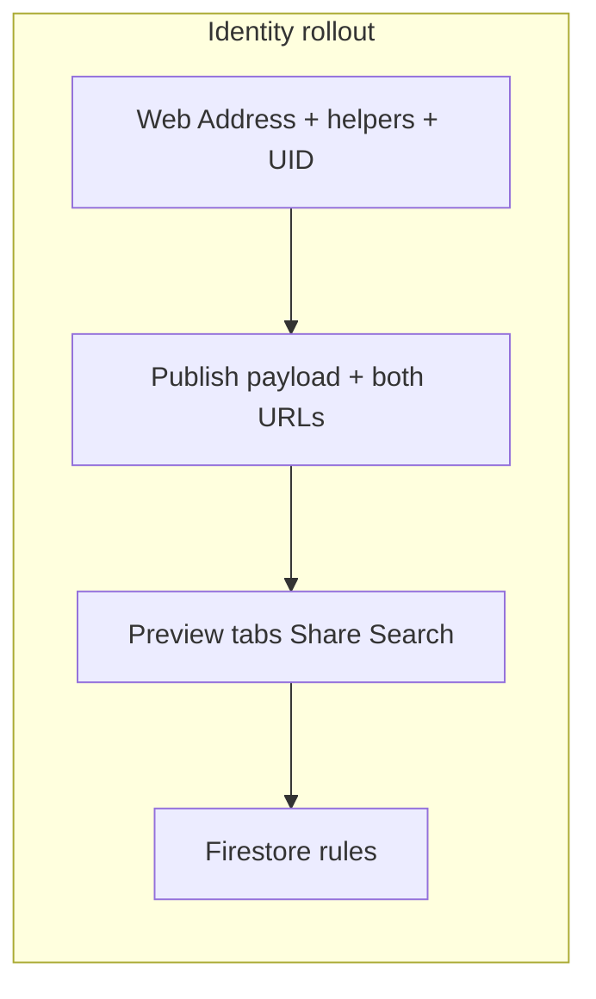
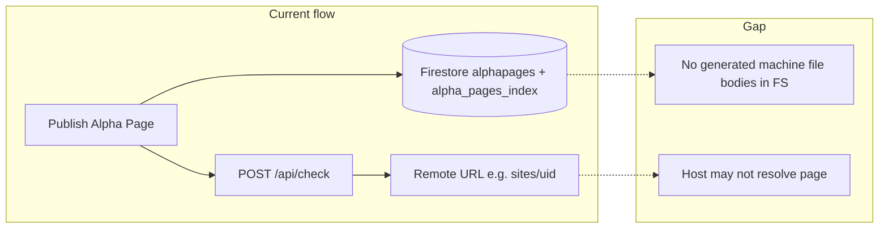

# Alpha Page — unified roadmap (identity + gaps)

This document **replaces** separate tracking for:

- [alpha_page_gaps_roadmap_2fb2cae8.plan.md](alpha_page_gaps_roadmap_2fb2cae8.plan.md) — product gaps and phases A–E  
- [alpha_page_uid_slug_identity_dc145bd2.plan.md](alpha_page_uid_slug_identity_dc145bd2.plan.md) — UID, slug, Web Address, preview tabs

**Relationship:** The **identity / preview-tabs** work is the **concrete client + data-model** foundation for URLs and “what users see” (Share + Search previews). The **gaps roadmap** covers **infrastructure** (hosting, DNS), **editor depth** (footer, RTE, DnD), **links**, **machine files**, and **QA**. Overlap is intentional: e.g. `ALPHA_PAGE_BASE_URL`, `canonical_url` / `public_url`, and `grid://{uid}` appear in both.

---

## Part A — Identity, UID, slug, Web Address, preview tabs

*Source: former “Alpha Page UID Slug Identity” plan.*

### Target model


| Concept           | Purpose                                | Example                                                    |
| ----------------- | -------------------------------------- | ---------------------------------------------------------- |
| **UID**           | Canonical machine identity (permanent) | `xK9mP2qR7s`                                               |
| **Slug**          | Human-friendly handle (editable)       | `gridnet-team`                                             |
| **Canonical URL** | Permanent source of truth              | `https://gridnetai.com/sites/xK9mP2qR7s`                   |
| **Public URL**    | Shareable / branding                   | `https://gridnetai.com/gridnet-team`                       |
| **Grid Address**  | Machine identity                       | `grid://xK9mP2qR7s` (optional display alias `grid://slug`) |


**Persist (merge with existing** `displayName` / `bio` / `signals` / `coverDataUrl` / `updatedAt`**):**

```json
{
  "uid": "xK9mP2qR7s",
  "slug": "gridnet-team",
  "name": "Gridnet Team",
  "caption": "Building AI as a Utility",
  "canonical_url": "https://gridnetai.com/sites/xK9mP2qR7s",
  "public_url": "https://gridnetai.com/gridnet-team",
  "grid_address": "grid://xK9mP2qR7s"
}
```

### Implementation chunks

1. **Identity UI** (`[public/index.html](public/index.html)`) — Order: Name *, Grid Address (read-only `grid://{pageUid}` once UID exists), **Web Address** (read-only `base + slug`), Caption *. Helper copy: Grid Address = permanent machine identity; Web Address = public page for Google, sharing, AI discovery.
2. **Page UID** — Generate once (short random id); persist in `alphapages/{userId}`; reuse on load. Slug from `slugify(name)` with user edits; Web Address updates with slug.
3. **Publish** — Merge `uid`, `slug`, `name`, `caption`, `canonical_url`, `public_url`, `grid_address` into save + `alpha_pages_index` path. Success message shows **both** canonical and public URLs.
4. **Preview tabs** — **[ Page ] [ Share ] [ Search ]** above phone mockup:
  - **Page** — current mockup (`updateAlphaPagePreview`).  
  - **Share** — OG / iMessage-style card (cover, title, caption, domain).  
  - **Search** — Google-style snippet (green URL line, title, meta description).  
   Refresh all from shared state when fields change.
5. **Firestore** — `[firestore.rules](firestore.rules)`: `alphapages/{userId}` read/write when `request.auth.uid == userId`.

**Note:** Resolving `https://gridnetai.com/{slug}` on the real internet is **hosting/DNS** — see Part B Phase A. Client stores and displays correct values first.




---

## Part B — Gap summary (broader product)


| Area                      | Current state                                                                                          | Gap                                                                                                       |
| ------------------------- | ------------------------------------------------------------------------------------------------------ | --------------------------------------------------------------------------------------------------------- |
| **Machine files**         | AI Visibility uses `POST /api/check` on canonical URL; publish writes `machineFiles` null placeholders | Verification only if URL reachable; no generated JSON-LD / llms / OpenAPI bodies in-app                   |
| **Footer / RTE / DnD**    | Plain fields, no block model                                                                           | Schema + builder + preview + index                                                                        |
| **Links (sharing style)** | Text/emoji in many surfaces                                                                            | Favicon/OG resolution; parity builder vs Alpha Page vs **search aggregate** (see also aggregate MVP plan) |
| **Identity in preview**   | Name + `grid://` with UID                                                                              | Largely addressed in code; QA ongoing                                                                     |
| **Public URLs**           | `ALPHA_PAGE_BASE_URL` often `gridnetai.com`                                                            | NXDOMAIN until host serves routes — Phase A below                                                         |


---

## Part B — Phases A–E (execution order)

### Phase A — Public pages and DNS alignment

**Goal:** Chosen base URL resolves; `/api/check` hits real HTML.

1. Decide canonical base (`gridnetai.com` vs Firebase-attached host).
2. Config-driven `ALPHA_PAGE_BASE_URL` (not only hardcoded in `[public/index.html](public/index.html)`).
3. `[firebase.json](firebase.json)` rewrites: e.g. `/p/:slug`, `/sites/:uid` → shell that reads Firestore (`alpha_pages_index` / `alphapages`); verify `[firestore.rules](firestore.rules)` for public read of published pages.
4. Extend `[docs/DEV.md](docs/DEV.md)` checklist: domain, SSL, rewrites, rules.

**Ties to Part A:** Canonical and public URLs from the identity model must match whatever host actually serves the shell.

---

### Phase B — Builder: footer, RTE, blocks + reorder

`contentBlocks` array; lightweight RTE; DnD; footer block; extend publish + `[alpha_pages_index](public/index.html)` (~10844–10870).

---

### Phase C — Links: favicons and richer cards

Client favicon helper and/or `GET /api/link-preview?url=` in `[functions/index.js](functions/index.js)`. Align **builder**, **preview tabs (Share)**, and **search results**.

---

### Phase D — Machine files: product choice

- **Option 1:** Verify-only UX + honest copy; optional `mode: 'remote_verify'` instead of null placeholders.  
- **Option 2:** Generate + store artifacts; expose via Phase A shell on canonical host.

---

### Phase E — QA

Identity preview, both URLs, AI Visibility, search index field compatibility (`[functions/index.js](functions/index.js)`), `alpha_pages_index` queries.

---

## Suggested order across the whole roadmap

1. **Part A (identity + preview tabs)** — Clarifies URLs and user-facing Share/Search previews in the builder.
2. **Phase A (hosting)** — Makes those URLs real where you control DNS.
3. **Phase B** — Editor depth.
4. **Phase C** — Link/preview polish everywhere.
5. **Phase D** — Machine files strategy.
6. **Phase E** — Ongoing QA.

*Related focused ship:* **Aggregate MVP** (search results Alpha Page row: `coverDataUrl`, card layout) may land **early** alongside Part A / Phase C for **search UI parity** — see [aggregate_mvp_alpha_page_polish](aggregate_mvp_alpha_page_polish_23fbe9cc.plan.md) if present.

---

## Files reference (combined)


| File                                       | Concerns                                                                                           |
| ------------------------------------------ | -------------------------------------------------------------------------------------------------- |
| `[public/index.html](public/index.html)`   | Identity UI, UID/slug/publish, preview tabs, `updateAlphaPagePreview`, `alpha_pages_index` publish |
| `[firestore.rules](firestore.rules)`       | `alphapages/{userId}`                                                                              |
| `[firebase.json](firebase.json)`           | Hosting rewrites for public shell                                                                  |
| `[functions/index.js](functions/index.js)` | `/api/search` alphaPages fields, `/api/check`, optional link-preview                               |
| `[docs/DEV.md](docs/DEV.md)`               | DNS, public URL limits                                                                             |


---

## Mermaid — publish and verify (from gaps plan)




---

*You can archive or delete the two predecessor plan files once this unified doc is the source of truth.*