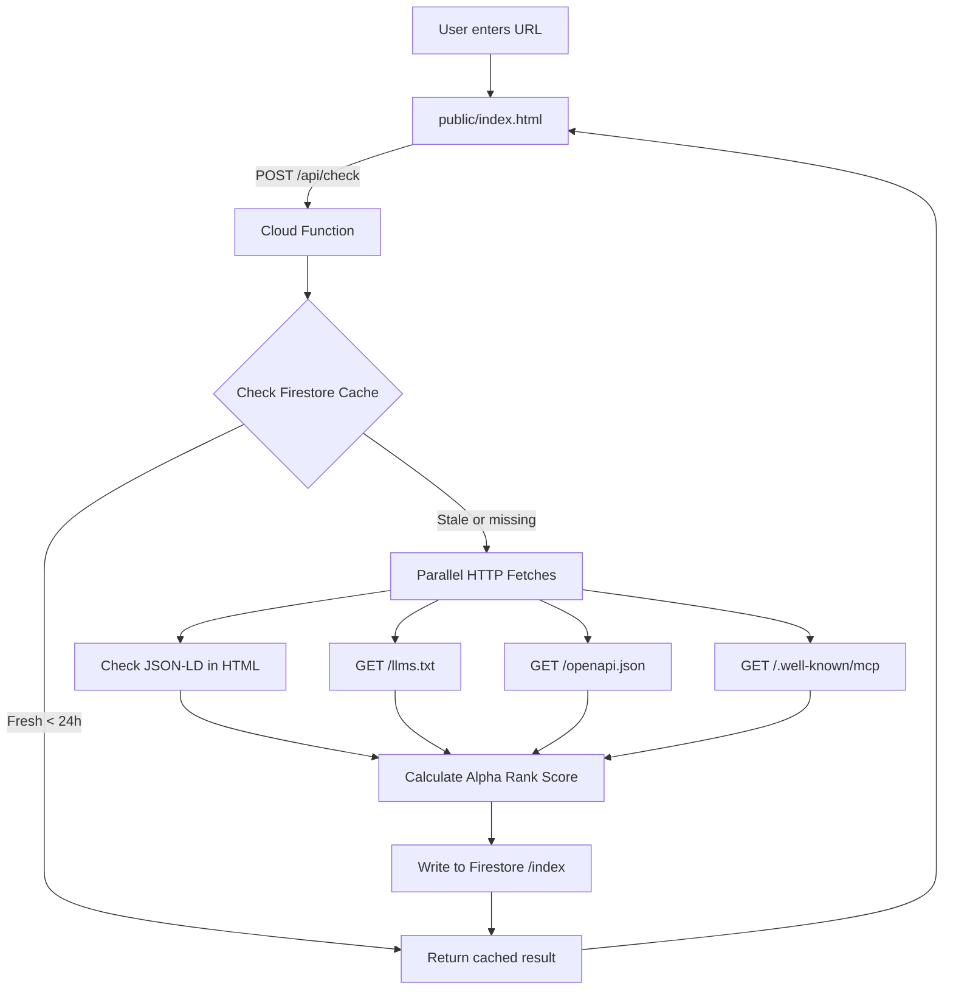

# Build Alpha Search Index — Machine Web Crawler

## Overview

Build the Alpha Search Index "factory" — a Firebase-hosted web app that crawls URLs for AI readiness signals (JSON-LD, llms.txt, OpenAPI, MCP), calculates an Alpha Rank Score, and stores results publicly in Firestore. The existing HTML prototype will be wired to a real Cloud Function backend.

## Architecture



## Implementation Steps

### 1. Firebase Project Setup

**Files to create:**

- [`firebase.json`](firebase.json) — Hosting + Functions + Firestore config
- [`.firebaserc`](.firebaserc) — Project ID mapping
- [`package.json`](package.json) — Root dependencies (Firebase CLI)
- [`functions/package.json`](functions/package.json) — Cloud Functions dependencies
- [`firestore.rules`](firestore.rules) — Security rules (public read, function-only write)

**Key configuration:**

- Hosting rewrites: `/api/**` → Cloud Functions
- Functions runtime: Node.js 18
- Firestore rules: Public read on `/index/{domain}`, append-only `/submissions`

### 2. Core Crawler Logic

**File:** [`functions/crawler.js`](functions/crawler.js)

**Exports:**

- `normalizeDomain(input)` — Strip protocol, www, paths
- `crawlDomain(domain)` — Parallel fetch of 4 endpoints with 5-8s timeouts
- `parseJsonLd(html)` — Regex check for `<script type="application/ld+json">`
- `calculateScore(results)` — Apply locked scoring formula (JSON-LD +10, llms.txt +12, OpenAPI +13, MCP +15, resolves +8)
- `getGrade(score)` — Map score to grade tier (90+ = AI Native, 70-89 = AI Ready, etc.)

**Technology:**

- Native `fetch()` with `AbortSignal.timeout()`
- `Promise.allSettled()` for parallel requests
- No external HTTP libraries (use Node 18 built-in fetch)

### 3. Cloud Function API Endpoint

**File:** [`functions/index.js`](functions/index.js)

**Endpoint:** `POST /api/check`

**Request body:**

```json
{ "url": "stripe.com" }
```

**Flow:**

1. Normalize domain
2. Check Firestore `/index/{domain}` for existing record
3. If cached and fresh (< 24h), return immediately with `cached: true`
4. Otherwise, call `crawlDomain()` from crawler.js
5. Write result to Firestore with timestamp
6. Return JSON response with score, grade, machineProfile

**Response format:**

```json
{
  "domain": "stripe.com",
  "score": 93,
  "grade": "AI Native",
  "gradeClass": "ai-native",
  "machineProfile": {
    "jsonLd": true,
    "llmsTxt": true,
    "openApi": true,
    "mcp": true,
    "resolves": true
  },
  "cached": false
}
```

### 4. Firestore Schema

**Collections:**

**`/index/{domainId}`** — Public index of crawled domains

```javascript
{
  domain: "stripe.com",
  alphaRankScore: 93,
  grade: "AI Native",
  gradeClass: "ai-native",
  machineProfile: {
    jsonLd: true,
    llmsTxt: true,
    openApi: true,
    mcp: true
  },
  verification: {
    resolves: true,
    crawlVerified: true,
    claimedByOwner: false
  },
  firstCrawled: Timestamp,
  lastCrawled: Timestamp,
  crawlCount: 1
}
```

**`/submissions/{submissionId}`** — Audit trail (optional, for future use)

**`/crawl_queue/{id}`** — Queue for batch imports (future feature)

### 5. Wire Prototype to Real API

**File:** [`public/index.html`](public/index.html)

**Changes to make:**

1. **Remove fake `profiles` lookup object** (lines with hardcoded stripe.com, github.com data)
2. **Replace simulated 2-second delay** with real `fetch()` call to `/api/check`
3. **Update `handleSearch()` function:**

   - Call `POST /api/check` with `{ url: domain }`
   - Handle response JSON to populate score card
   - Show error state if domain doesn't resolve (score 0, "Not AI Ready")

4. **Keep all existing UI/CSS unchanged** — only swap data source
5. **Add error handling** for network failures

**Minimal code change:**

```javascript
// OLD (fake):
const p = profiles[domain] || { score: 9, ... };

// NEW (real):
const response = await fetch('/api/check', {
  method: 'POST',
  headers: { 'Content-Type': 'application/json' },
  body: JSON.stringify({ url: domain })
});
const p = await response.json();
```

### 6. Design System Compliance

**Reference:** [`docs/DESIGN_GUIDE.md`](docs/DESIGN_GUIDE.md)

**Non-negotiable rules:**

- Background: `#e8eaf0` (search PWA variant, NOT `#e0e5ec` Grid Grey)
- Fonts: DM Sans (UI) + DM Mono (labels/data)
- Shadows: `--neu-raised`, `--neu-inset`, `--neu-flat` (already in prototype)
- Grade pill colors: ai-native (green), ai-ready (blue), machine-ready (purple), listed (orange), not-ready (red)
- Reverse UZ flow: default=raised, hover/focus=inset
- No external libraries (pure HTML/CSS/JS)

**Verification:** The provided HTML prototype already implements this correctly — preserve it exactly.

### 7. Deployment

**Steps:**

1. Initialize Firebase: `firebase init` (select Hosting, Functions, Firestore)
2. Install dependencies: `npm install` in root and `functions/`
3. Test locally: `firebase serve` (emulates hosting + functions)
4. Deploy: `firebase deploy`
5. Verify at: `https://<project-id>.web.app`

**Environment variables (if needed):**

- None required for basic crawling (uses public HTTP endpoints)
- Future: Add API keys for enhanced crawling (robots.txt parsing, etc.)

## Key Technical Decisions

### Scoring Formula (Locked)

```
JSON-LD present     → +10 pts
llms.txt present    → +12 pts
OpenAPI present     → +13 pts
MCP endpoint live   → +15 pts
Domain resolves     → +8 pts
────────────────────────────
Max from crawl: 58 pts
(Remaining 42 pts from verification/engagement layers — future)
```

### Grade Thresholds (Locked)

```
90–100 → AI Native
70–89  → AI Ready
50–69  → Machine Ready
30–49  → Listed
0–29   → Not AI Ready
```

### Crawl Endpoints (Fixed)

```
https://{domain}/llms.txt
https://{domain}/.well-known/mcp
https://{domain}/openapi.json
https://{domain}/ (homepage for JSON-LD)
```

### Cache Strategy

- 24-hour freshness window
- Re-crawl on demand if stale
- Store `lastCrawled` timestamp in Firestore
- Return `cached: true` flag in API response

## Files to Create

1. **Root config:**

   - `firebase.json`
   - `.firebaserc`
   - `package.json`
   - `firestore.rules`

2. **Cloud Functions:**

   - `functions/index.js` (API endpoint)
   - `functions/crawler.js` (crawl logic)
   - `functions/package.json`

3. **Public site:**

   - `public/index.html` (wire prototype to API)

## What NOT to Do

- ❌ Don't redesign the UI — only wire real data
- ❌ Don't use CSS frameworks (Tailwind, Bootstrap)
- ❌ Don't use UI libraries (shadcn, MUI)
- ❌ Don't add model provider branding
- ❌ Don't fetch from browser — all HTTP crawls are server-side
- ❌ Don't change score formula or grade thresholds
- ❌ Don't add authentication to public checker (zero-friction required)

## Success Criteria

✅ User enters "stripe.com" → real crawl runs → score card displays with actual data

✅ Cached results return instantly (< 200ms) for recent crawls

✅ All 4 endpoints checked in parallel (< 8 seconds total)

✅ Firestore `/index` collection populates with public data

✅ UI matches design system exactly (neumorphic shadows, DM fonts, grade pills)

✅ Deployed to Firebase Hosting and accessible via public URL

## Context

This is the **data factory** for Alpha Search. Every URL check seeds a public index of the machine web. The public index is the product. Freshness is the moat. This is infrastructure for the AI era — the S&P 500 for the machine web.