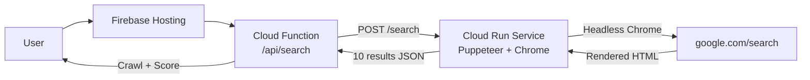

# Cloud Run Puppeteer Scraper Implementation

## Overview

Replace the current non-functional HTTP scraper with a Cloud Run service that runs Puppeteer (headless Chromium). Google's search page requires JavaScript execution, which the current HTTP scraper cannot handle. This solution uses a real browser to execute JavaScript and extract rendered results.

## Architecture



## Implementation Steps

### 1. Create Cloud Run Service Structure

**New directory**: `scraper-service/` (project root level)

Create three files:

**`scraper-service/package.json`**:

- Dependencies: express, puppeteer
- Start script for Cloud Run

**`scraper-service/index.js`**:

- Express server with POST `/search` endpoint
- Puppeteer scraping logic with:
  - User agent rotation (8 UAs)
  - Random delays (800-2000ms)
  - Headless Chrome launch with Cloud Run-compatible args
  - DOM evaluation to extract results after JS execution
  - Returns: `{ results: [{ link, title, snippet }] }`

**`scraper-service/Dockerfile`**:

- Base: node:20-slim
- Install Chromium and dependencies
- Configure Puppeteer to use system Chromium
- Expose port 8080

**`scraper-service/.dockerignore`**:

- Exclude node_modules and logs

### 2. Deploy to Cloud Run

**Command** (from `scraper-service/` directory):

```bash
gcloud run deploy alpha-search-scraper \
  --source . \
  --region us-central1 \
  --platform managed \
  --allow-unauthenticated \
  --memory 2Gi \
  --cpu 2 \
  --timeout 60 \
  --concurrency 5 \
  --min-instances 1 \
  --project alpha-search-index
```

**Key settings**:

- 2Gi memory (Chrome needs RAM)
- 2 CPU (Chrome needs compute)
- 60s timeout (page load + JS execution)
- Concurrency 5 (limit Chrome instances)
- **min-instances 1** (keeps one warm, avoids 15-30s cold starts, ~$5/month)

**Output**: Cloud Run URL like `https://alpha-search-scraper-xxx-uc.a.run.app`

### 3. Update Cloud Function Integration

**File**: `functions/index.js`

**Changes**:

1. Replace current `googleSearch()` function to call Cloud Run service
2. Use `SCRAPER_URL` environment variable
3. POST to `${SCRAPER_URL}/search` with query
4. 30s timeout for scraper call
5. Return results in same format: `[{ url, title, description }]`

**Critical mapping**: The scraper returns `{ link, title, snippet }` but downstream code expects `{ url, title, description }`. The Cloud Function MUST map this:

```javascript
const searchResults = data.results.map(r => ({
  url: r.link,
  title: r.title,
  description: r.snippet
}));
```

If this mapping is missing, the scoring pipeline breaks silently.

**File**: `functions/.env`

Add:

```
SCRAPER_URL=https://alpha-search-scraper-xxx-uc.a.run.app
```

### 4. Update Fallback Chain

**Current flow** (from previous implementation):

```
Direct Scraper → Google Custom Search → SerpAPI
```

**New flow**:

```
Cloud Run Puppeteer → Google Custom Search → SerpAPI
```

Replace the call to the old `googleSearch()` (HTTP scraper) with the new Cloud Run version. Keep the fallback chain intact.

### 5. Create Test Scripts

**File**: `test-cloud-run.js` (project root)

Standalone test that:

- Calls Cloud Run service directly
- Tests with query: "Terry French San Antonio founder"
- Validates response format
- Reports success/failure clearly

### 6. Update Documentation

**File**: `SCRAPER_STATUS.md`

Update to reflect:

- Cloud Run Puppeteer is now the primary method
- HTTP scraper deprecated (doesn't work)
- Cloud Run deployment instructions
- Cost implications (Cloud Run pricing)

**New file**: `CLOUD_RUN_DEPLOYMENT.md`

Deployment guide with:

- Prerequisites (gcloud CLI, project setup)
- Step-by-step deployment
- Testing instructions
- Troubleshooting common issues

## Files Created/Modified

### New Files

- `scraper-service/package.json` - Service dependencies
- `scraper-service/index.js` - Puppeteer scraper service (~150 lines)
- `scraper-service/Dockerfile` - Container definition
- `scraper-service/.dockerignore` - Build exclusions
- `test-cloud-run.js` - Test script
- `CLOUD_RUN_DEPLOYMENT.md` - Deployment guide

### Modified Files

- `functions/index.js` - Update `googleSearch()` to call Cloud Run
- `functions/.env` - Add `SCRAPER_URL`
- `SCRAPER_STATUS.md` - Update with Cloud Run status

### Deprecated (Keep for Reference)

- `functions/scraper.js` - HTTP scraper (doesn't work, keep as reference)
- `debug-scraper.js` - Debug script (keep for documentation)

## Files NOT Changed

- `functions/crawler.js` - No changes to scoring logic
- `public/index.html` - No UI changes
- `/api/check` endpoint - Unchanged
- Firestore schema - Unchanged
- All downstream crawling/scoring logic - Unchanged

## Testing Strategy

1. **Unit test Cloud Run**: `curl` the service directly
2. **Integration test**: Run `test-cloud-run.js`
3. **End-to-end test**: Search for "Michael Jordan" in UI
4. **Verify fallback**: Disable Cloud Run URL, verify fallback returns empty array gracefully (SerpAPI not configured, UI should handle empty results without crashing)

## Cost Implications

**Cloud Run Pricing** (us-central1):

- Memory: 2Gi × $0.0000025/GB-second
- CPU: 2 vCPU × $0.00002400/vCPU-second
- Requests: $0.40 per million

**Estimated cost per search**:

- ~5 seconds execution time
- ~$0.0003 per search
- 1,000 searches = ~$0.30

**Much cheaper than SerpAPI** ($0.005 per search after free tier).

## Deployment Prerequisites

User needs:

- gcloud CLI installed and authenticated
- Project: `alpha-search-index`
- Cloud Run API enabled
- Billing enabled on GCP project

## Success Criteria

- Cloud Run service deploys successfully
- Returns 5-10 results for common queries
- Response time < 10 seconds per search
- Falls back to SerpAPI if Cloud Run fails
- Zero changes to `/api/search` response format
- Existing UI continues to work unchanged

## Risk Mitigation

**Risk**: Google may still block Cloud Run IPs

**Mitigation**:

- User agent rotation
- Random delays
- Multi-region deployment (optional)
- SerpAPI fallback ensures service continuity

**Risk**: Cold start latency

**Mitigation**:

- Cloud Run keeps instances warm with traffic
- 60s timeout accommodates cold starts
- Consider min-instances=1 for production

## Future Enhancements (Not in This Plan)

- Multi-region deployment with load balancing
- Request queuing for rate limiting
- Caching layer for popular queries
- Alpha Browser node integration (distributed scraping)

## Deployment Steps Summary

1. Create `scraper-service/` directory structure
2. Deploy to Cloud Run: `gcloud run deploy ...`
3. Copy Cloud Run URL
4. Add to `functions/.env`: `SCRAPER_URL=...`
5. Update `functions/index.js` to call Cloud Run
6. Test with `test-cloud-run.js`
7. Deploy functions: `firebase deploy --only functions`
8. Test end-to-end in UI

Total time: ~30 minutes (excluding Cloud Run build time)