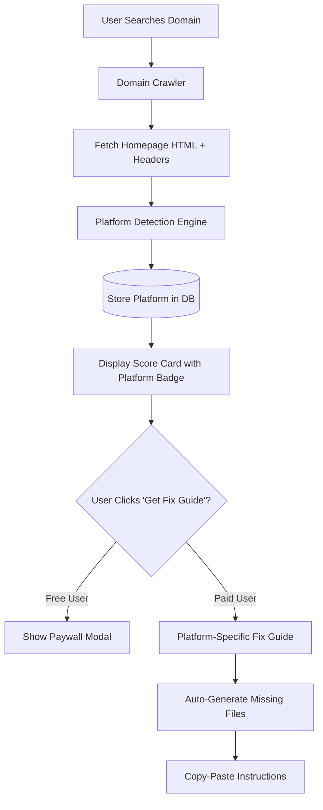

# Platform Detection & AI Readiness Fix Feature

## Overview

When users discover their site isn't AI ready, they ask "How do I fix it?" This feature detects the website platform (Wix, WordPress, Shopify, Squarespace, etc.) and provides platform-specific instructions to improve their Alpha Score. **Free platform detection + paid detailed fix guide.**

## Architecture Flow




## Implementation Plan

### 1. Platform Detection Engine

**Create:** `[functions/platform-detector.js](functions/platform-detector.js)`

Detect platforms using HTTP headers, HTML meta tags, script sources, and CSS patterns:

**Detection Signals:**

- **Wix**: `X-Wix-Request-Id` header, `static.parastorage.com` assets, `<meta name="generator" content="Wix.com">`
- **WordPress**: `wp-content`, `wp-includes` paths, `<meta name="generator" content="WordPress">`
- **Shopify**: `myshopify.com`, `cdn.shopify.com`, `Shopify.theme` in scripts
- **Squarespace**: `static1.squarespace.com`, `X-Squarespace-Renderer` header
- **Webflow**: `webflow.io`, `webflow-script`, `data-wf-page` attributes
- **Weebly**: `editmysite.com`, `weebly.com` assets
- **GoDaddy**: `secureserver.net`, `godaddysites.com`
- **Hostinger**: `hostinger.com`, `000webhostapp.com`
- **Custom**: Fallback when no platform detected

**Function signature:**

```javascript
async function detectPlatform(domain, html, responseHeaders)
```

### 2. Database Schema Updates

**Modify:** `[functions/db/schema.sql](functions/db/schema.sql)`

Add platform detection fields to `record_domains` table:

```sql
ALTER TABLE record_domains ADD COLUMN IF NOT EXISTS platform VARCHAR(50);
ALTER TABLE record_domains ADD COLUMN IF NOT EXISTS platform_confidence VARCHAR(20); -- 'high', 'medium', 'low'
ALTER TABLE record_domains ADD COLUMN IF NOT EXISTS platform_signals JSONB; -- Array of detected signals
CREATE INDEX idx_record_domains_platform ON record_domains(platform);
```

### 3. Crawler Integration

**Modify:** `[functions/crawler.js](functions/crawler.js)`

In the `crawlDomain()` function (line 121-224), after fetching the homepage:

1. Extract response headers from the homepage fetch
2. Call `detectPlatform(domain, html, headers)`
3. Add platform data to the return object

**Modify:** `[functions/api-extensions.js](functions/api-extensions.js)`

In `dualWriteDomainResult()` (line 25-122), add platform fields to `type_data`:

```javascript
const type_data = {
  // ... existing fields ...
  platform: crawlResult.platform || 'unknown',
  platform_confidence: crawlResult.platformConfidence || null,
  platform_signals: crawlResult.platformSignals || []
};
```

### 4. Fix Guide Templates

**Create:** `[functions/fix-guides/](functions/fix-guides/)` directory with platform-specific templates:

- `wix-guide.js` - Wix-specific instructions (JSON-LD via SEO dashboard, llms.txt workaround)
- `wordpress-guide.js` - WordPress plugin recommendations
- `shopify-guide.js` - Shopify app store solutions
- `squarespace-guide.js` - Squarespace code injection methods
- `webflow-guide.js` - Webflow custom code embedding
- `custom-guide.js` - Generic developer instructions

Each guide exports:

```javascript
module.exports = {
  platform: 'wix',
  canFix: {
    jsonLd: true,      // User can fix without developer
    llmsTxt: 'partial', // Workaround available
    openApi: false,    // Not applicable
    mcp: false         // Not applicable
  },
  instructions: {
    jsonLd: { steps: [...], difficulty: 'easy', video_url: null },
    llmsTxt: { steps: [...], difficulty: 'medium', video_url: null }
  },
  autoGenerate: {
    jsonLd: (domainData) => { /* return JSON-LD code */ },
    llmsTxt: (domainData) => { /* return llms.txt content */ }
  }
};
```

### 5. Backend API Endpoint

**Create:** New Cloud Function endpoint `/api/get-fix-guide`

```javascript
exports.getFixGuide = functions.https.onRequest(async (req, res) => {
  // 1. Verify user authentication
  // 2. Check if user has paid tier access (Stripe integration)
  // 3. Fetch domain record from Cloud SQL (includes platform)
  // 4. Load platform-specific guide template
  // 5. Auto-generate missing files (JSON-LD, llms.txt, etc.)
  // 6. Return personalized fix guide with copy-paste code
});
```

### 6. Frontend UI Updates

**Modify:** `[public/index.html](public/index.html)`

**In `buildScoreCard()` function (line ~3180):**

1. Add platform badge below domain name:

```html
<div class="platform-badge" style="display: inline-block; padding: 2px 8px; background: rgba(255,255,255,0.1); border-radius: 4px; font-size: 10px; margin-left: 8px;">
  ${data.platform || 'Unknown Platform'}
</div>
```

1. Enhance "What to do next" section with platform-specific context:

```html
<div class="suggestions">
  <div class="suggestions-title">
    How to fix on ${data.platform}
    <button class="get-fix-guide-btn" onclick="openFixGuide('${domain}', '${data.platform}')">
      Get Complete Fix Guide →
    </button>
  </div>
  ${/* platform-aware suggestions */}
</div>
```

1. Add new modal for fix guide display (similar to settings modal)

**Add JavaScript functions:**

- `openFixGuide(domain, platform)` - Opens modal or paywall
- `loadFixGuide(domain)` - Fet

