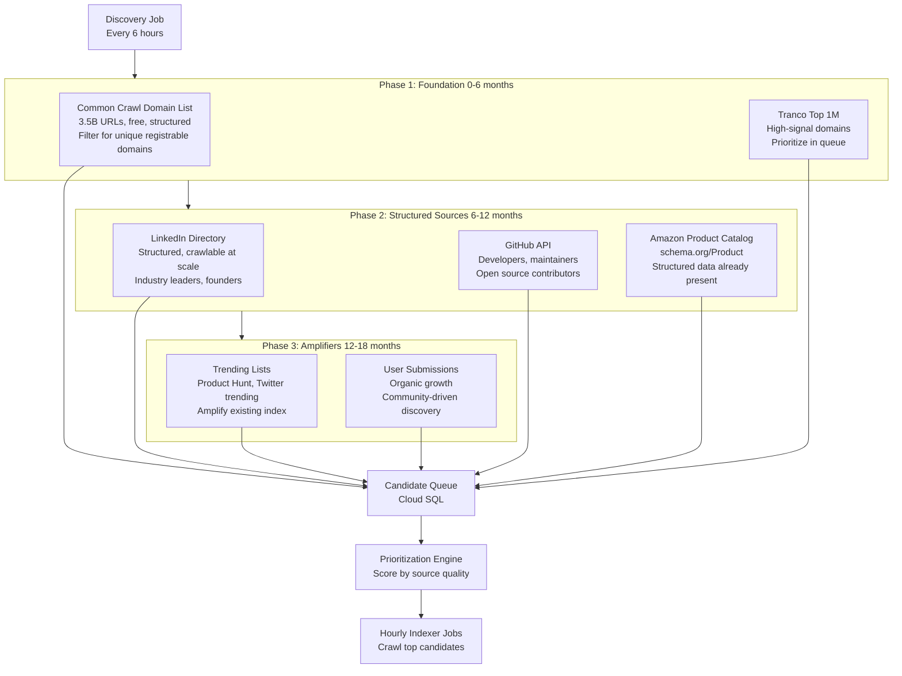

# Refine Alpha Search Index Architecture

## Current GCP Setup

**Deployed Infrastructure:**

- Cloud Run service: `alpha-search-scraper` (Puppeteer for name search)
- Cloud Functions: `apiHandler` (domain crawling, name search orchestration)
- Firestore: `index` collection (2.4M domain records with 24hr cache)
- Firebase Hosting: Frontend UI
- **SerpAPI**: Primary search provider for name searches (Cloud Run Puppeteer blocked by Google)

**What's Working:**

- Domain crawling via `/api/check` endpoint
- Name search via `/api/search` endpoint (using SerpAPI)
- 24-hour cache for domain records
- Real-time AI Records counter (Firestore-backed)

**What's Missing:**

- People and product indexing
- Tiered TTL caching
- Source attribution tracking
- Systematic discovery system
- Cloud SQL infrastructure

**Note on SerpAPI:**

Currently using SerpAPI as the primary search provider for name searches. The Cloud Run Puppeteer scraper is deployed but Google is blocking requests (expected behavior). SerpAPI provides reliable results at $0.01 per search after the free tier (100 searches/month).

**SerpAPI Cost Structure:**

- Free tier: 100 searches/month
- Paid tier: $50/month for 5,000 searches ($0.01/search)
- Current usage: Low volume (testing phase)

---

## Architecture Updates

### 1. Add `entity_source` Column to Schema

**Current problem:** The schema stores what was found (`machine_profile` JSONB) but not where it was found at the record level. When crawling people across LinkedIn, GitHub, Wikipedia, and personal sites, we need independent source tracking.

**Update `ai_records` table:**

```sql
CREATE TABLE ai_records (
  -- Identity
  id BIGSERIAL PRIMARY KEY,
  entity_type VARCHAR(20) NOT NULL,
  entity_id VARCHAR(500) NOT NULL,
  entity_canonical VARCHAR(500),
  
  -- AI Readiness Score
  alpha_score INTEGER,
  grade VARCHAR(50),
  grade_class VARCHAR(50),
  
  -- Machine Profile
  machine_profile JSONB,
  
  -- NEW: Source Attribution
  entity_source JSONB,  -- Which sources contributed, when last checked
  
  -- Cache Management
  first_indexed TIMESTAMP DEFAULT NOW(),
  last_indexed TIMESTAMP DEFAULT NOW(),
  index_count INTEGER DEFAULT 1,
  cache_valid_until TIMESTAMP,
  cache_ttl_hours INTEGER,  -- NEW: Track TTL used (24, 48, 168)
  
  -- Verification
  verified BOOLEAN DEFAULT FALSE,
  claimed_by_user_id VARCHAR(128),
  
  -- Search
  search_vector TSVECTOR,
  
  UNIQUE(entity_type, entity_id)
);

CREATE INDEX idx_entity_source ON ai_records USING GIN(entity_source);
CREATE INDEX idx_cache_ttl ON ai_records(cache_ttl_hours);
```

**`entity_source` JSONB structure:**

```json
{
  "sources": [
    {
      "platform": "LinkedIn",
      "url": "https://linkedin.com/in/sama",
      "last_checked": "2026-03-12T10:30:00Z",
      "status": "active",
      "score_contribution": 25,
      "signals_found": ["structured_data", "profile_complete"]
    },
    {
      "platform": "GitHub",
      "url": "https://github.com/sama",
      "last_checked": "2026-03-12T10:30:00Z",
      "status": "active",
      "score_contribution": 13,
      "signals_found": ["readme", "repos"]
    }
  ],
  "primary_source": "LinkedIn",
  "sources_count": 2,
  "last_source_check": "2026-03-12T10:30:00Z"
}
```

**Why this matters:**

- Query which sources contribute most to high-scoring entities
- Re-crawl individual sources independently (LinkedIn every 7 days, GitHub every 14 days)
- Build source reliability metrics
- API consumers can see data provenance

---

### 2. Implement Tiered TTL Caching

**Current problem:** All entities use 24-hour cache. This is correct for domains but too aggressive for people (profiles change slowly) and products (moderate change frequency).

**Create `cache_config` table:**

```sql
CREATE TABLE cache_config (
  entity_type VARCHAR(20) PRIMARY KEY,
  ttl_hours INTEGER NOT NULL,
  description TEXT,
  updated_at TIMESTAMP DEFAULT NOW()
);

INSERT INTO cache_config VALUES
  ('domain', 24, 'Domains change frequently - APIs, docs, endpoints', NOW()),
  ('person', 168, 'People profiles change slowly - 7 days', NOW()),
  ('product', 48, 'Products change moderately - pricing, inventory', NOW());
```

**Impact on re-indexing load at 30M records:**

Current (24hr for all):

- 30M records / 24 hours = 1.25M re-crawls/day = 52K/hour = 867/minute

With tiered TTLs:

- 10M domains / 24 hours = 417K/day
- 10M people / 168 hours = 60K/day
- 10M products / 48 hours = 208K/day
- **Total: 685K/day = 28.5K/hour = 475/minute**

**Reduction: 45% fewer re-crawls** while maintaining appropriate freshness per entity type.

---

### 3. Design Discovery System (Prioritized Execution Order)

**The critical question:** How does Alpha Search grow from 2.4M to 30M AI Records?

**Answer:** Systematic crawling in a specific order, not trending lists or user submissions.

#### Discovery Execution Sequence



#### Phase 1: Foundation (0-6 months) - Domains

**1. Common Crawl Domain List (Primary Source)**

- **What**: 3.5 billion URLs from monthly web crawls
- **URL**: `https://commoncrawl.org/`
- **Cost**: Free (S3 access)
- **Strategy**:
  - Download domain list from latest crawl
  - Extract unique registrable domains (e.g., `stripe.com` not `api.stripe.com`)
  - Filter for domains with AI signals in HTTP headers (JSON-LD, OpenAPI refs)
  - Queue for indexing
- **Expected yield**: 100M+ unique domains
- **Why first**: Systematic, reproducible, free, already structured

**2. Tranco Top 1M (Priority Boost)**

- **What**: Research-grade top 1M domains list
- **URL**: `https://tranco-list.eu/`
- **Cost**: Free
- **Strategy**:
  - Download daily
  - Cross-reference with Common Crawl list
  - Boost priority score for domains in Tranco (higher quality)
  - Queue high-priority domains first
- **Expected yield**: 1M high-signal domains
- **Why second**: Adds quality signal to Common Crawl base, not noisy

#### Phase 2: Structured Sources (6-12 months) - People & Products

**3. LinkedIn Directory (People)**

- **Strategy**: Systematic crawl of LinkedIn public profiles
- **Target**: C-level executives, founders, technical leaders
- **Rate limit**: 100 profiles/hour (respect ToS)
- **Expected yield**: 2K people/day = 360K/6 months
- **Why**: Structured, crawlable at scale, professional context

**4. GitHub API (People)**

- **Strategy**: GitHub API for developers, maintainers, contributors
- **Target**: Open source maintainers, prolific contributors
- **Expected yield**: 500 people/day = 90K/6 months
- **Why**: Structured data, API access, developer focus

**5. Amazon Product Catalog (Products)**

- **Strategy**: Parse Amazon product pages with schema.org/Product markup
- **Target**: Best sellers across 50+ categories
- **Expected yield**: 5K products/day = 900K/6 months
- **Why**: Structured data already present, high-quality catalog

#### Phase 3: Amplifiers (12-18 months) - Growth Acceleration

**6. Trending Lists (All Entity Types)**

- Product Hunt (new products)
- Twitter trending (people, topics)
- Hacker News (domains, people)
- **Strategy**: Layer on top of existing index as amplifiers
- **Expected yield**: 1K entities/day
- **Why last**: Requires existing index to contextualize trends

**7. User Submissions (All Entity Types)**

- **Strategy**: Users search for entities not in index → queue for indexing
- **Expected yield**: Organic growth, scales with user base
- **Why last**: No users at scale yet, grows naturally over time

#### Discovery Queue Table

```sql
CREATE TABLE discovery_queue (
  id BIGSERIAL PRIMARY KEY,
  entity_type VARCHAR(20) NOT NULL,
  entity_id VARCHAR(500) NOT NULL,
  priority_score INTEGER DEFAULT 50,  -- 0-100
  discovered_at TIMESTAMP DEFAULT NOW(),
  discovery_source VARCHAR(100),  -- 'common_crawl', 'tranco', 'linkedin', etc.
  discovery_phase INTEGER,  -- 1, 2, or 3
  indexed BOOLEAN DEFAULT FALSE,
  indexed_at TIMESTAMP,
  
  UNIQUE(entity_type, entity_id)
);

CREATE INDEX idx_priority ON discovery_queue(priority_score DESC, indexed);
CREATE INDEX idx_discovery_source ON discovery_queue(discovery_source);
CREATE INDEX idx_discovery_phase ON discovery_queue(discovery_phase);
```

**Priority scoring:**

- Common Crawl domain: 50 (base)
- Common Crawl domain + Tranco: 80 (high priority)
- LinkedIn profile: 70
- GitHub profile: 65
- Amazon product: 75
- Trending list: 60
- User submission: 90 (highest - immediate demand)

#### Growth Projections

**Current state:** 2.4M domains

**With systematic discovery:**

- **Month 3**: +2M domains (Common Crawl) = 4.4M total
- **Month 6**: +5M domains (Common Crawl + Tranco) = 9.4M total
- **Month 9**: +2M domains, +500K people (LinkedIn/GitHub) = 11.9M total
- **Month 12**: +3M domains, +1M people, +1M products (Amazon) = 16.9M total
- **Month 18**: +5M domains, +5M people, +5M products (all sources) = **31.9M total**

**Timeline to 30M: 18 months** (Q4 2027)

---

## 4. Update Architecture Documents

### [ALPHA_INDEX_ARCHITECTURE.md](ALPHA_INDEX_ARCHITECTURE.md)

**Section: "Unified Schema (Cloud SQL)"**

- Add `entity_source JSONB` column with structure example
- Add `cache_ttl_hours INTEGER` column
- Add `cache_config` table definition

**Section: "Automated Routine Updates"**

- Update cache logic to query `cache_config` table for TTL
- Show tiered TTL calculation

**Section: "Cloud Scheduler Jobs"**

- Expand Job 4 (discover) with full specification
- Add 3-phase discovery strategy
- Add execution order: Common Crawl → Tranco → LinkedIn/GitHub → Amazon → Trending → Submissions

**New Section: "Discovery System Architecture"**

- Add phased discovery diagram (mermaid)
- Document each discovery source with rationale for order
- Add `discovery_queue` table schema
- Add priority scoring algorithm
- Add 18-month growth projections

**Section: "Scaling to 30M AI Records"**

- Update cost estimates:
  - Cloud SQL: $200/month (unchanged)
  - Cloud Storage: $20/month (unchanged)
  - Cloud Run indexer: $50/month (unchanged)
  - Discovery API costs: $50/month (Common Crawl free, Tranco free, GitHub API free tier)
  - SerpAPI: Variable based on usage (see cost projections below)
  - **Total: ~$320-$820/month** depending on search volume (vs $2,000+/month with Firestore)
- Update timeline: 18 months to 30M (not 5 weeks)
- Add tiered TTL savings: 45% reduction in re-crawl load

**SerpAPI Cost Projections by Growth Period:**

**Month 0-3 (Testing/Launch):**

- Search volume: ~500 searches/month
- Cost: $0 (free tier covers 100/month) + $4/month for 400 searches
- **SerpAPI cost: ~$4/month**

**Month 3-6 (Early Growth):**

- Search volume: ~2,000 searches/month
- Cost: $50/month plan (covers 5,000 searches)
- Cache hit rate: ~20% (most searches are new)
- Effective searches: 1,600 new + 400 cached
- **SerpAPI cost: ~$50/month**

**Month 6-12 (Scaling):**

- Search volume: ~10,000 searches/month
- Cost: $50/month base + $50/month overage (5,000 additional searches)
- Cache hit rate: ~40% (index growing, more repeat searches)
- Effective searches: 6,000 new + 4,000 cached
- **SerpAPI cost: ~$100/month**

**Month 12-18 (Maturity):**

- Search volume: ~50,000 searches/month
- Cost: $50/month base + $450/month overage (45,000 additional searches)
- Cache hit rate: ~70% (mature index, high cache efficiency)
- Effective searches: 15,000 new + 35,000 cached
- **SerpAPI cost: ~$500/month**

**Post-18 Months (Native Search Transition):**

- Search volume: ~100,000+ searches/month
- Strategy: Transition to native search index (Common Crawl + Tranco + systematic crawling)
- SerpAPI usage: Reduced to 20% (fallback only)
- Effective searches: 20,000 via SerpAPI + 80,000 via native index
- **SerpAPI cost: ~$200/month** (declining as native index matures)

**Key Cost Drivers:**

- Cache hit rate dramatically reduces SerpAPI costs (70% hit rate = 70% cost reduction)
- Native search index (Phase 3) eliminates SerpAPI dependency for discovery
- SerpAPI remains as fallback for edge cases and new entity types

**Section: "Migration Path"**

- **Update Phase 1**: Mark as "DEPRECATED - Skip to Phase 2"
- **Rationale**: Don't extend Firestore for people/products, migrate them twice is wasted work
- **New recommendation**: Go straight to Cloud SQL migration

---

### [PHASE_1_IMPLEMENTATION.md](PHASE_1_IMPLEMENTATION.md)

**Add deprecation notice at top:**

```markdown
## DEPRECATED - Skip to Phase 2

This phase (extending Firestore for people and products) is no longer recommended.

**Rationale:**
- Migrating people/products records twice (Firestore → Cloud SQL) is wasted work
- Cloud SQL is required for scale (30M records)
- Better to implement people/products directly in Cloud SQL

**Recommendation:**
- Skip Phase 1 entirely
- Go straight to Phase 2 (Cloud SQL migration)
- Implement people/products in Cloud SQL from the start

See [ALPHA_INDEX_ARCHITECTURE.md](ALPHA_INDEX_ARCHITECTURE.md) for updated migration path.
```

---

## 5. Implementation Phases (Updated)

### Phase 1: DEPRECATED

~~Extend Firestore for people & products~~

**Skip this phase.** Go straight to Phase 2.

### Phase 2: Cloud SQL Migration (2 weeks)

- Set up Cloud SQL PostgreSQL instance
- Create `ai_records` table with `entity_source` and `cache_ttl_hours`
- Create `cache_config` table
- Create `discovery_queue` table
- Migrate existing 2.4M domain records from Firestore
- Update Cloud Functions to query Cloud SQL
- Implement tiered TTL caching

### Phase 3: Discovery System (2 weeks)

- Build Cloud Run service for discovery job
- Implement Common Crawl domain extraction
- Implement Tranco list integration
- Set up Cloud Scheduler (every 6 hours)
- Implement priority scoring
- Deploy to production

### Phase 4: People & Products (2 weeks)

- Implement LinkedIn crawler
- Implement GitHub API integration
- Implement Amazon product parser
- Add person/product scoring algorithms
- Update frontend for entity type selection

### Phase 5: Background Indexer (1 week)

- Build Cloud Run service for re-indexing expired cache
- Set up hourly Cloud Scheduler jobs
- Implement batch processing (100 records/minute)
- Monitor and optimize

**Total timeline: 7 weeks** (not including 18-month discovery growth period)

---

## Success Criteria

After architecture updates:

- Schema includes `entity_source` for source attribution
- Schema includes `cache_ttl_hours` for tiered caching
- Tiered TTL strategy documented (domains 24hr, people 7d, products 48hr)
- Discovery system fully specified with 7 sources in 3 phases
- Execution order clear: Common Crawl → Tranco → LinkedIn/GitHub → Amazon → Trending → Submissions
- Growth path from 2.4M to 30M documented (18 months)
- Cost estimates updated ($320/month at 30M records)
- Phase 1 marked as deprecated
- Recommendation to skip to Phase 2 (Cloud SQL) documented

---

## Key Decisions Documented

1. **entity_source field**: Queryable column, not just in machine_profile JSONB
2. **Tiered TTLs**: Domains 24hr, people 7d, products 48hr (45% re-crawl reduction)
3. **Discovery order**: Common Crawl first (3.5B URLs, free, systematic), not trending lists
4. **Skip Phase 1**: Don't extend Firestore, go straight to Cloud SQL
5. **Timeline**: 18 months to 30M (realistic), not 5 weeks